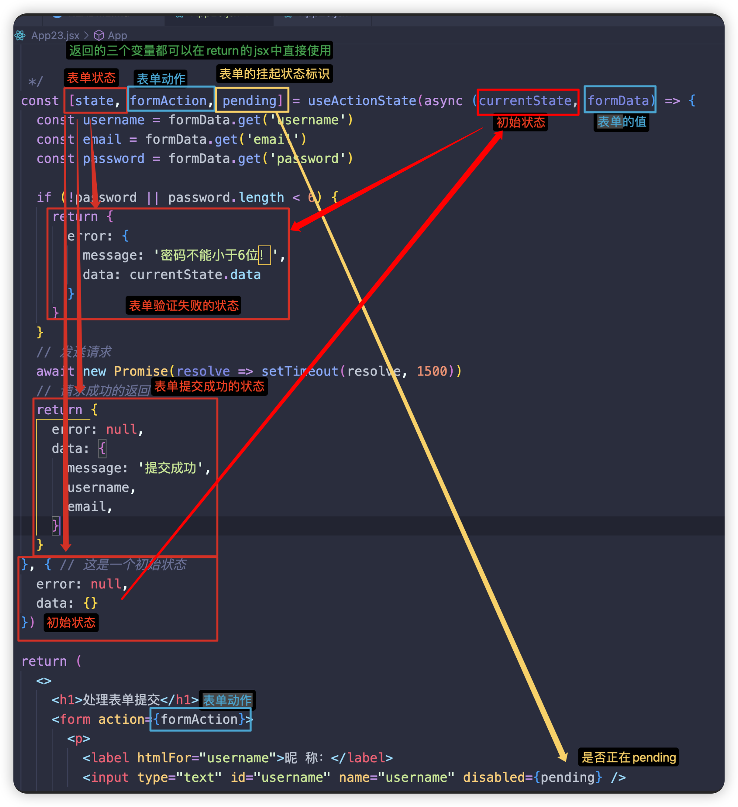
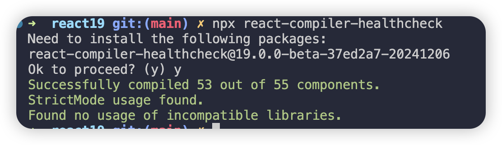

# use
全新的 api，在渲染中读取资源
 - 可以使用 use 读取一个 promise，react 将挂起，直到 promise 解析完成
 - use 用于直接处理异步数据和操作
 - use 可以用在条件语句中
 - use 可以用在循环里
 - 捕获错误
# 严格模式
严格模式的所有检查和警告仅在开发模式下有效，不会影响生产环境的性能。严格模式不会改变渲染结果，仅提供警告信息和额外检查。
嵌套使用：可以在组件树的不同部分使用严格模式
```jsx
// 只有 ComponentA 及其子组件会受到严格模式的检查。
function App() {
  return (
    <div>
      <React.StrictMode>
        <ComponentA />
      </React.StrictMode>
      <ComponentB />
    </div>
  );
}

```
## 作用
1. 识别不安全的生命周期
   - 严格模式会对旧的、不安全的生命周期方法发出警告，例如` componentWillMount``、componentWillReceiveProps` 和 `componentWillUpdate。`
   - 这些方法在 React Fiber 架构下可能导致问题，因此建议避免使用。
2. 检测意外的副作用
   - React 的严格模式会额外调用函数组件中的副作用两次（如 `useEffect` 中的代码）。
   - 目的是确保这些副作用逻辑是纯函数，不会产生不可预测的行为。
3. 识别遗留的字符串引用Ref
   - 字符串形式的 Ref 已被废弃，严格模式会检测并警告使用了 `ref="string"` 的情况。
4. 检查过时的 `findDOMNode`:
   - `findDOMNode` 是一个访问 DOM 节点的旧方法，严格模式会对其发出警告。
   - 建议使用 `ref` 来代替
5. 确保使用合法的Context API
   - 严格模式会检测旧版的 Context API（React.createContext 之前的版本）并发出警告。
6. 识别重复的key属性
   - 对于列表中的元素，如果没有唯一的 key，严格模式会发出警告。
## 严格模式下的双调用
为了检测潜在的副作用，React 会在严格模式下对以下函数组件行为进行双调用：
1. 初次挂载组件时的生命周期
  - `constructor`
  - `render`
  - `componentDidMount`
2. 函数组件中的初始化和副作用清理：
  - React 会调用两次函数组件的主题代码，以及 `useEffect`的清理逻辑
## 常见问题与解决方法
### 1. 副作用执行两次
  - 解决方法一：确保所有副作用代码(`useEffect`)是幂等的，即多次执行产生相同结果。
  ```jsx
  useEffect(() => {
    const timer = setInterval(() => console.log('Running...'), 1000);
    return () => clearInterval(timer); // 确保清理定时器
  }, []);
  ```
  - 解决方法二：定义一个全局flag，判断flag并且执行一次后锁住，就不会多次执行。
  ```jsx
  function App() {
    // 定义组件是否已加载过
    const hasLoaded = useRef(false)
    // 严格模式下会执行两次
    useEffect(()=> {
      // 如果开发模式下不想有些操作执行两次，可以这样做：
      // if里的只有首次执行
      if(!hasLoaded.current) {
        console.log('首次执行的操作')
        hasLoaded.current = true;
      }
    }, [])// 依赖项
    return <div>... </div>
  }
  ```
### 2. 遗留的生命周期方法
  - 解决：将旧方法替换为安全的生命周期方法，例如用 `componentDidUpdate` 替代 `componentWillUpdate` 。
### 3. findDOMNode的警告
  - 解决：使用`ref`获取 DOM 节点。
  ```jsx
  const inputRef = React.createRef();
  return <input ref={inputRef} />;
  ```
# Suspense
- Suspense会等待包裹的异步组件加载好再渲染，在此期间会使用fallback属性中的内容来暂时渲染UI
- 包裹Promise
  - Suspense可以捕获子组件向外抛出的 promise,并且会等待Promsie完成再重新渲染子组件
  - Suspense可以同时管理多个挂起的 Promsie，所有挂起的 Promise 必须解析，才能结束 Suspense 的挂起状态。
- Suspense也可以异步渲染图片/资源
- 进行数据获取、更改数据
- Suspense组件可以嵌套使用，管理不同子树的挂起状态
## Suspense 工作原理
Suspense 是 React 提供的用于管理异步数据加载的机制。它通过挂起（suspending）组件的渲染，直到其依赖的资源（例如数据或动态导入的代码）加载完成，同时显示 fallback 指定的备用 UI。

**核心流程**

1. 检测挂起状态：
  - 当组件中使用了异步资源（如 Promise），React 检测到这些资源未就绪时，会触发挂起。
  - Suspense 会中断组件的渲染，等待异步任务完成。
2. 触发挂起：
  - 组件内的异步操作（如 Promise）会抛出一个挂起状态，通知 React 当前任务尚未完成。
  - React 捕获挂起状态，停止渲染流程。
3. 显示备用 UI：
  - 在挂起期间，React 渲染最靠近的 Suspense 组件的 fallback。
  - 这通常是一个加载指示器或占位符。
4. 异步任务完成：
  - 当异步任务完成（Promise resolved），组件重新开始渲染，并用实际内容替换 fallback。


# useRef
useRef用于管理不参与组件渲染流程的可变引用。
当数据的变化不需要触发组件的渲染的使用可以使用 useRef，可以替代 useState。
# useImperativeHandle
- 用于自定义通过 ref 暴露给父组件的实例值或方法，让父组件可以通过 ref 访问子组件中自定义的值或方法，而不仅仅 DOM 节点。

# createContext
- 通过 createContext 创建上下文，可以直接使用返回的对象包裹要通信的子组件们，也可以.Provider API。

- 在子组件中可以通过use使用context

# useDeferredValue
- 用于实现延迟更新。可以帮助 React 应用中优化性能，尤其在处理高优先级和低优先级更新时提供更流畅的用户体验。
- 接受一个值并返回一个延迟的值(deferred value)
- 如果传入的值在一段时间内发生了变化，useDeferredValue会延迟更新返回的值，优先让其他更高优先级的任务完成。

# useTransition
- 用于控制更新优先级，允许将某些更新标记为“过度任务”(Transition)。
- 通过将任务分为高优先级和低优先级，可以提升用户体验，尤其是在处理复杂耗时的更新时。

# FormAction
FormAction的 action 属性类似于传统 HTML 表单的 action，但它接受的一个函数而不是URL。
**自动处理FormData**
- 当表单提交时，React会自动创建 FormData对象
- 不需要手动调用 preventDefault()
- 不需要手动收集表单数据
有了FormData可以讲数据访问简化
# useFormStatus
用于获取表单的提交状态。它返回一个对象，其中包含pending属性，表示表单是否正在提交。
useFormStatus钩子函数没有参数
```jsx
const { pending, data, method, action } = useFormStatus();
```
## 参数信息：
`pending`：布尔值。如果form表单正在执行提交操作，就为true。否则为false
`data`：一个`FormData`接口对象的实现，包含了表单提交的data值。如果没有正在提交的表单，或者上级标签没有<form>，则为null
`method`：一个`get`或 `post`字符串值。代表form正在用`get`或者`post`这种http方法提交。默认`get`,并且可以通过这个参数指定方法。
`action`：一个传递<form>表单action属性的方法引用。如果没有<form>元素，则值为null；如果值是一个`URI`，或者没有指定action属性值， `status.action`将会是null。

## 注意：
1. useFormStatus钩子函数必须被一个<form>元素内部渲染的组件调用。
2. useFormStatus将只返回form表单的状态信息。不会返回在 同一个组件或子组件中 渲染的任何 <form> 表单的状态信息

# useActionState
用于在表单提交后处理状态。
它返回一个对象，其中包含 data 和 error 属性，分别表示表单提交后的数据和错误信息。
在组件的顶层调用 useActionState 即可创建一个随 表单动作被调用 而更新的 state。
```jsx
const [state, formAction, isPending] = useActionState(fn, initialState, permalink?);
```
## 参数

在调用 useActionState 时在参数中传入现有的表单动作函数`fn`以及一个初始状态`{}`，无论表单action后是否在 pending 中，它都会返回一个新的 `action` 函数和一个 `form state` 以供在 form 中使用。
这个新的 form state 也会作为参数传入提供的表单动作函数。

form state 是一个只在表单被提交触发 action 后才会被更新的值。如果该表单没有被提交，该值会保持传入的初始值不变。

## 返回值
useActionState返回一个包含以下值的数组：

1. 当前的 state。第一次渲染期间，该值为传入的初始状态的参数值。在 action 被调用后该值会变为action动作函数的返回值。
2. 一个新的 action 函数，用于在你的 form 组件的 action 参数或在表单中子组件的 formAction 参数中传递。
3. 一个 isPending 标识，用于表明是否有正在 pending 的 Transition。

## 注意
- 在支持 React 服务器组件的框架中使用该功能时，useActionState 允许表单在服务器渲染阶段时获得部分交互性。当不使用服务器组件时，它的特性与本地 state 相同。
- 与直接通过表单动作调用的函数不同，传入 useActionState 的函数被调用时，会多传入一个代表 state 的上一个值或初始值的参数作为该函数的第一个参数。


## 执行过程
表单被提交后，传入的 action 函数会被执行，返回值将会作为该表单的新的当前state。
传入的 action 接受到的第一个参数将会变为该表单的当前state。当表单第一次被提交时将会传入提供的初始state，只会都将传入上一次调用action函数的返回值。

# useOpitimistic
此钩子函数专门用于处理**乐观更新**的场景，乐观更新是一种优化技术，用于在用户与界面交互时，立即更新UI，从而提供更流畅的体验，而无需等待后端的响应。

```jsx
const [optimisticState, addOptimistic] = useOptimistic(stateValue, reducerFn)

```
## 参数
1. 一个通过useState返回值state值，就是要乐观更新的值。
2. 一个reducer函数，类似于redux里的函数，函数体中有返回的对象。
   - 参数1: state
   - 参数2: action对象

## 返回值
1. `optimisticState`: 是reducer函数中返回的对象，也代表你替换了原state值的乐观更新值。
2. `addOptimistic`: 派发器。
   - 类似redux中的`dispatch`。
   - 可以通过派发不通的 type 和携带的value值，进入reducer函数中走不通的条件语句，从而返回不同的对象。

## 注意
- 乐观更新后，渲染的jsx中使用的是 `optimisticState`，而不是一开始的state值。
- 为了确保出错后可以回退到原来的值，通常和 `useTransition` 一起使用。 `addOptimistic` 的操作通常在 `startTransition` 的参数函数内。
- 提供错误边界。使用`try catch`完善错误情况。

# React Compiler
新的编译器，用于在构建阶段自动优化React应用程序。
可以在不重写代码，就可以实现对组件和钩子中的值或者值组进行自动记忆化处理，减少不必要的计算，提升应用性能。

包括两部分：
- 编译器
- 代码检查工具

## 安装
```bash
yarn add -D babel-plugin-react-compiler@beta eslint-plugin-react-compiler@beta
```
编译器包含一个 Babel 插件，你可以在构建流水线中使用它来运行编译器。

## eslint-plugin-react-compiler
是一个 eslint 插件，用于在代码审查和开发过程中检测和修复不符合 react compiler 的规则的问题。

```js
const ReactCompilerConfig = { /* ... */ };

export default defineConfig(() => {
  return {
    plugins: [
      react({
        babel: {
          plugins: [
            ["babel-plugin-react-compiler", ReactCompilerConfig],
          ],
        },
      }),
    ],
    // ...
  };
});
```

## babel-plugin-react-compiler
React Compiler的babel插件，用于在构建过程中自动优化 React 应用程序。

```js
// vite.config.js
const ReactCompilerConfig = { /* ... */ };
// https://vite.dev/config/
export default defineConfig({
  plugins: [
    react({
      babel: {
        plugins: [
          ["babel-plugin-react-compiler", ReactCompilerConfig],
        ]
      }
    })
  ],
})

```

## react-compiler-healthcheck
可以帮助开发者分析代码库是否符合 ReactCompiler 的优化要求

```
npx react-compiler-healthcheck
```
